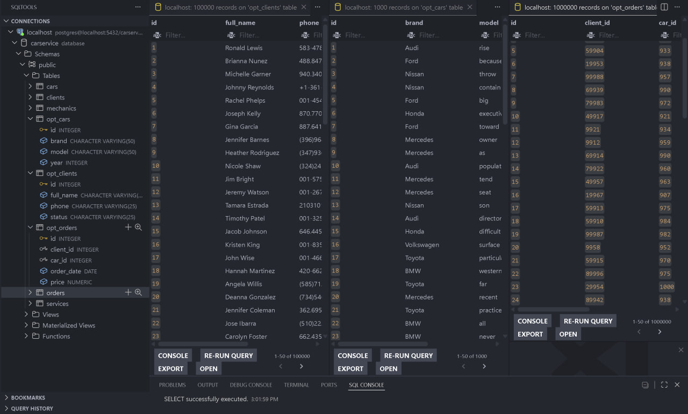
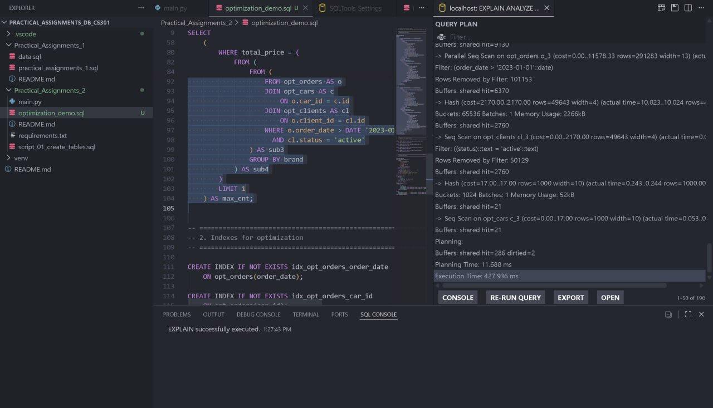
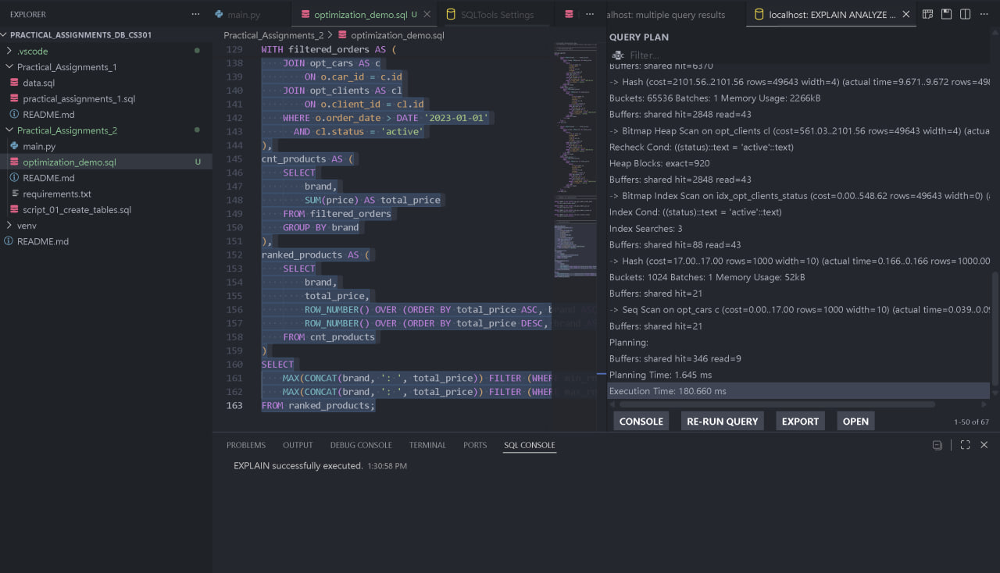

# Practical Assignment 2 (без додаткового завдання)

База даних станції технічного обслуговування (СТО). Оптимізація з порівнянням execution plans

Таблиці

opt_clients - 100.000 клієнтів
opt_cars - 1.000 автомобілів
opt_orders - 1.000.000 замовлень

Оптимізується запит який знаходить бренд автомобіля з найбільшою і найменшою сумою замовлень серед active клієнтів після 2023

До оптимизації Execution Time 427.9 ms запит був написаний через важкі вкладені підзапити

Після 180.6 ms додав індекси та переписав запит через CTE 

CTE
Розбиття великого запиту на 3 простих кроки
1. filtered_orders - беремо мільйон замовлень і відсікаємо все, що до 2023, залишаємо лише активних клієнтів і робимо join таблиць один раз
2. cnt_brands - вираховуємо суму грошей SUM(price) для кожного бренду машини
3. ranked_brands - за допомогою функції ROW_NUMBER() база за один прохід ставить бренди від найбіднішого до найбагатшого, одразу знаходячи min і max