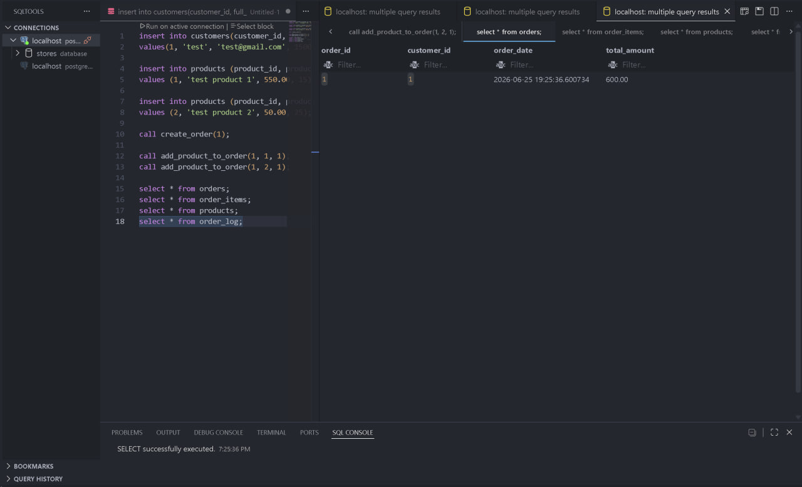
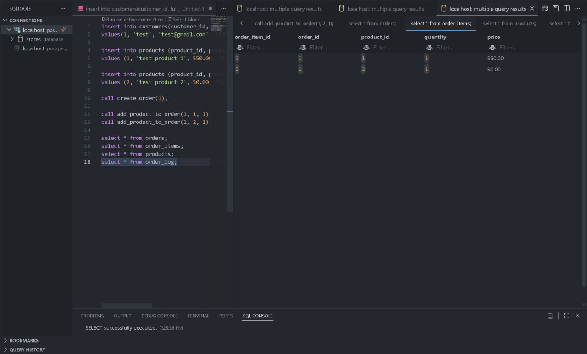
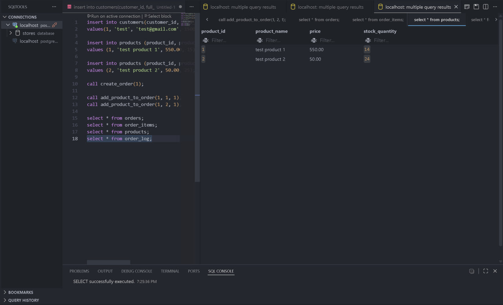
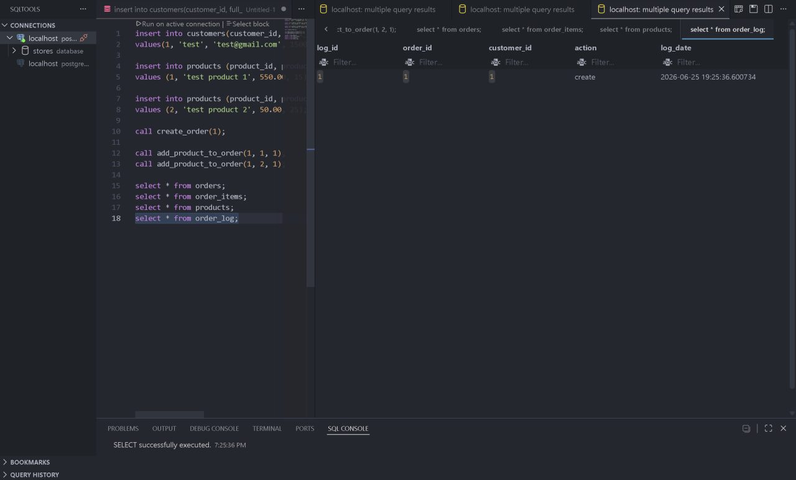

# Practical_Assignment_3

Є 5 таблиць customers, product, orders, order_items, order_log 

task 1 — функція calculate_order_total
Вона рахує суму замовлення через sum(quantity * price) і повертає 0 якщо замовлення порожнє через coalesce

task 2 — процедура create_order
Створює нове замовлення для клієнта з total_amount = 0 і поточним timestamp

task 3 — процедура add_product_to_order
Додає товар до замовлення і також перевіряє що кількість більше 0 і що на складі достатньо товару. Зменшує stock_quantity після додавання

task 4 — тригер total_trigger
Спрацьовує після insert, update, delete на order_items. Апдейтить total_amount в orders через функцію з task 1

task 5 — тригер log_trigger
Записує в order_log кожне нове замовлення

task 6 — тестування
Показує що клієнти можуть бути створені; продукти можуть бути створені; замовлення можуть бути створені за допомогою процедури; продукти можуть бути додані до замовлень за допомогою процедури; загальна сума замовлень оновлюється автоматично; запаси продуктів зменшуються коректно; створення замовлення реєструється в order_log.

