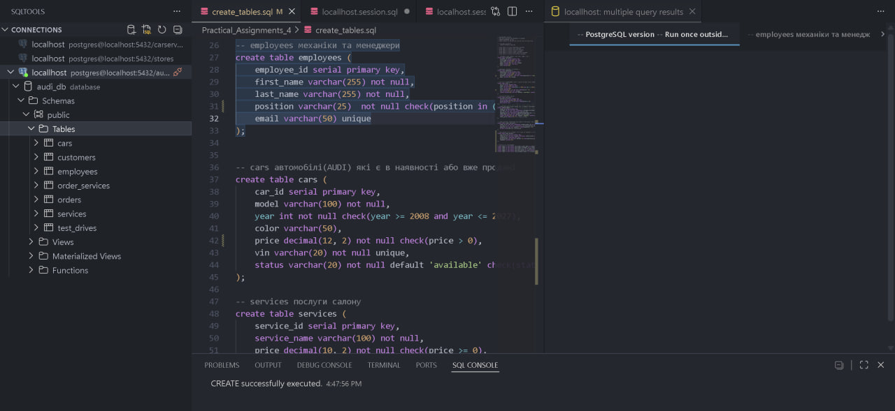
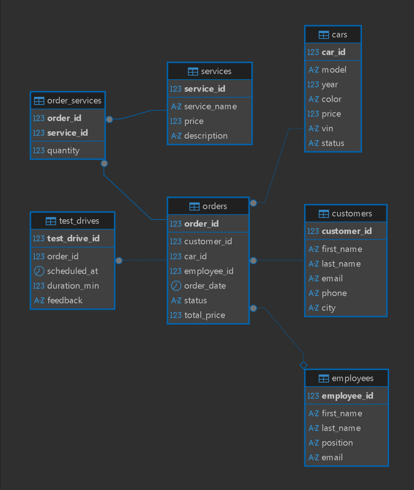
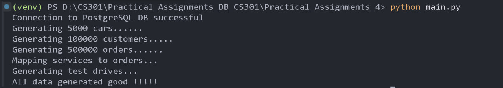
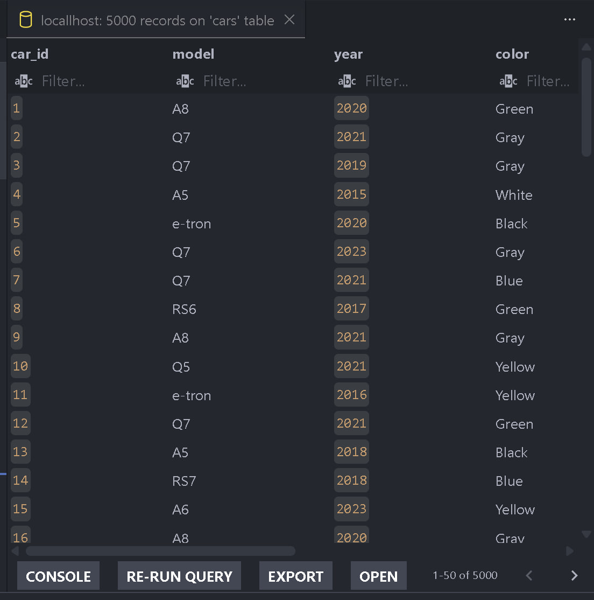
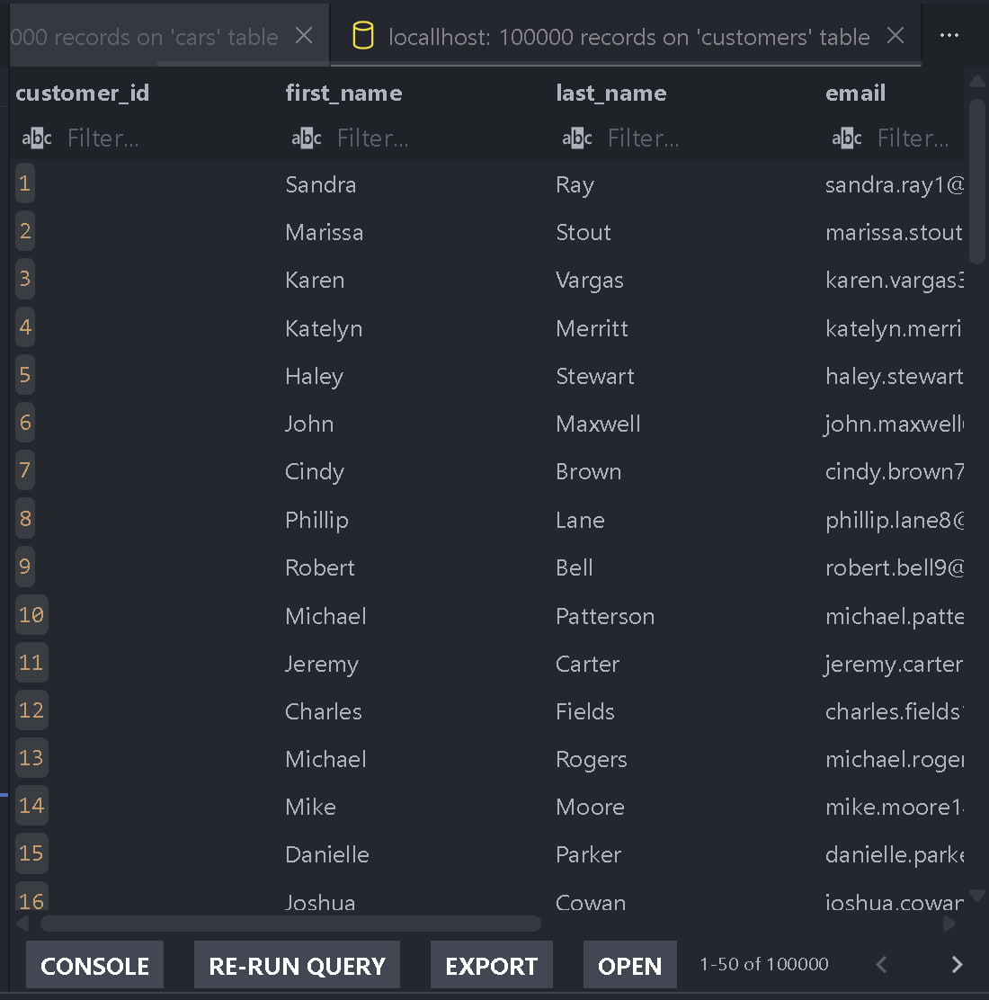
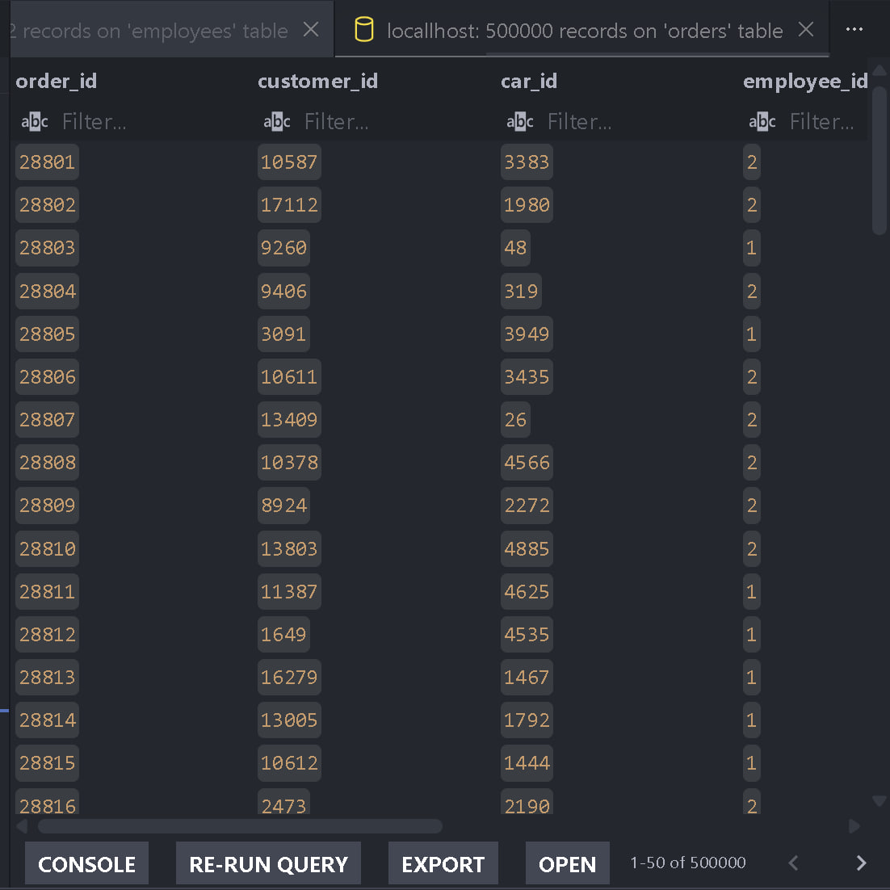
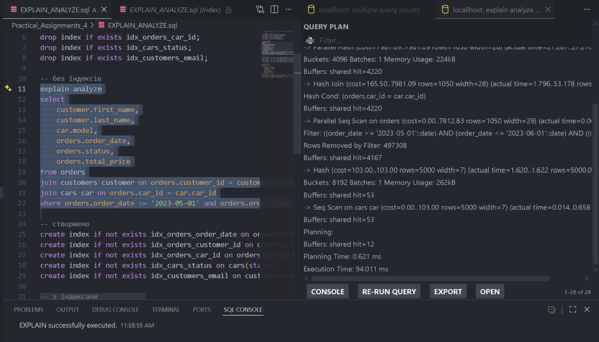
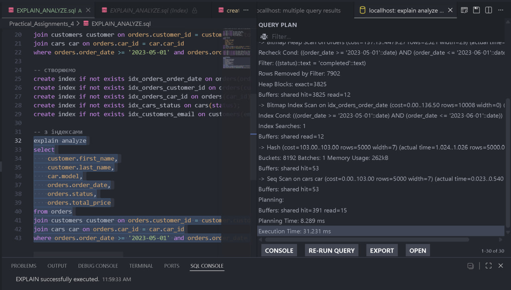

# Practical Assignment 4 (Audi Dealership)

Таблиці

customers клієнтів на 100.000 записів
employees механіки та менеджери
cars автомобілі Audi
services послуги сервісу
orders транзакції (1:many з customers, 500.000 записів)
order_services таблиця для зв'язку послуг із замовленнями (зв'язок many:many)
test_drives тест-драйв (1:1 через unique)

## ERD

Генерація данних(main.py)

Успішне наповнення бази даних

EXPLAIN_ANALYZE

Запит знаходить completed замовлення за травень 2023 з інформацією про клієнта і авто

Без індексів +- 94 ms

З індексами +- 31 ms 

AI using
Використовувався ШІ для пошуку багів і фікса їх